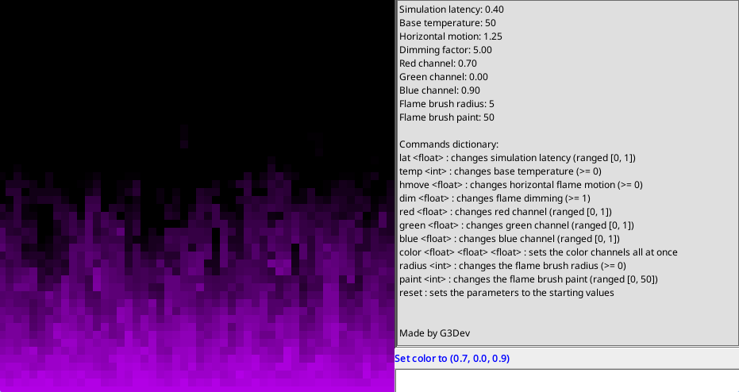

# ToolBox
A Java library for creating fast and simple sketches.

## Table of Contents
+ [Sketch options](#sketch-options-)
+ [Input](#input-)
+ [Drawing](#drawing-)
+ [Creating your sketch](#creating-your-sketch-)
+ [To-Do](#to-do-)

## Sketch options [#](#table-of-contents)
The sketch can be customized in many ways:
+ `void setTickRate(int tickrate)`: sets the update rate (number of `update()` calls per second)
+ `void setFrameRate(int framerate)`: sets the frames per second, or FPS, (the amount of `render()` calls per second)
+ `void autoClear(boolean toggle)`: toggles the automatic screen clearing (if set to `false` you'll see the classic "Windows XP dragging" effect).

The sketch window can be further customized by changing its title, size and the canvas pixel scale (the amount of actual screen pixels per canvas pixel).\
These parameters can only be set at the beginning of the sketch when instantiating it, therefore you can set them by providing their values as the canvas creation method parameters in `void createCanvas(String title, int width, int height, int pixelScale)`.

## Input [#](#table-of-contents)
This toolbox comes in with easy to use input methods:
+ `boolean isKeyPressed(int key)`: returns true only on the key press, then returns false also while holding it
+ `boolean isKeyDown(int key)`: returns true when the key is pressed, even while holding it
+ `boolean isKeyReleased(int key)`: returns true only on the key release
There are also the mouse methods:
+ `boolean isButtonPressed(int button)`: returns true only on the button press, then returns false also while holding it
+ `boolean isButtonDown(int button)`: returns true when the button is pressed, even while holding it
+ `boolean isButtonReleased(int button)`: returns true only on the button release
The keyboard methods require a `java.awt.event.KeyEvent.VK_keycode` number, while the button methods require `Input.button_BUTTON`.
There are also wheel scroll and mouse cursor position detection methods:
+ `int getMouseScroll()`: returns the mouse scroll wheen amount and direction
+ `int getMouseX()`: returns the cursor x position in canvas space, ranged [0, canvas width)
+ `int getMouseY()`: returns the cursor y position in canvas space, ranged [0, canvas height)
+ `int getCanvasMouseX()`: returns the cursor x position in canvas space taking into account pixel scale and screen translation
+ `int getCanvasMouseY()`: returns the cursor y position in canvas space taking into account pixel scale and screen translation
+ `int getMouseDeltaX()`: returns the cursor x movement
+ `int getMouseDeltaY()`: returns the cursor y movement

To perform an input check you can call the listed methods by using `input.METHOD(PARAMETERS)`.

## Drawing [#](#table-of-contents)
You can draw in the canvas thanks to the `screen` component.

The engine uses a right-handed y-up 2D coordinate system, meaning (0, 0) is the bottom left corner of the canvas, while the top right corner is at (`screen.getWidth() - 1`, `screen.getHeight() - 1`).

The screen module holds some methods for drawing single pixels, points, lines, rectangles, squares, triangles, vectors and much more!\
### Pixels, Lines and Shapes
+ `void setPixel(int x, int y, Color color)`: sets the given pixel color
+ `void point(int x, int y, int radius, Color color)`: draws a point at the given coordinates and with the specified color (not affected by shape filling and shape outline)
+ `void line(int x0, int y0, int x1, int y1, Color color)`: draws a line between the given point and with the specified color (not affected by shape filling and shape outline)
+ `void rectangle(int x0, int y0, int x1, int y1)`: draws a rectangle given two opposite corners. Uses the filling it with the shape filling color if enabled and drawing the outlines with the outlines color if enabled
+ `void ellipse(int cx, int cy, int xRadius, int yRadius)`: draws an ellipse with the given center coordinates and the given radiuses. Uses the filling it with the shape filling color if enabled and drawing the outlines with the outlines color if enabled
+ `void points(Vector2[] points, int radius, Color color)`: draws a point cloud (not affected by shape filling and shape outline)
+ `void lines(Vector2[] points, Color color, boolean close)`: draws a set of lines connecting the given points by closing the shape if needed (not affected by shape filling and shape outline)
+ `void polygon()`: still to implement (it will basically be a lines method that fills the pixels in the polygon bounding box by checking if the pixels is inside the enclosed area using cross products with all the polygon sides)
+ `void polarLine(int x, int y, int length, float radiansAngle, Color color)`: draws a line using the given polar coordinates (length and radiansAngle) and the specified color (not affected by shape filling and shape outline)
+ `void square(int x, int y, int side)`: draws a square at the given left corner position with the specified side length. Uses the filling it with the shape filling color if enabled and drawing the outlines with the outlines color if enabled
+ `void circle(int cx, int cy, int radius)`: draws a circle with the given center position and radius. Uses the filling it with the shape filling color if enabled and drawing the outlines with the outlines color if enabled
+ `void triangle(Vector2 p0, Vector2 p1, Vector2 p2)`: draws a triangle with the given vertices. Uses the filling it with the shape filling color if enabled and drawing the outlines with the outlines color if enabled
+ `void vector(Vector2 vector, int x, int y, Color color)`: draws the given vector at a specified location and with the given color (not affected by shape filling and shape outline)### Shape options
You can set the outline and fill colors, the brush shape and the stroke width via:
+ `fill(Color color)`: enables shape filling with the set color
+ `disableFill()`: disables shape filling
+ `outlines(Color color)`: enables shape outlines with the given color
+ `disableOutlines()`: disables shape outlines
+ `brush(int shape)`: sets the brush shape (either Screen.BRUSH_CURCLE or Screen.BRUSH_SQUARE)
+ `stroke(int width)`: sets the brush stroke with to the given amount

### Images
It is possible to render an image you loaded via `Image(String path)` with the `void image(Image image)` method.\
You can overlay screens together with `void overlay(Screen screen, int x, int y, int left, int right, int top, int bottom)`. This method will allow you to draw the given screen over the main one at a certain position (x, y) and by cutting a desired amount of pixels from it (left, right, top, bottom).\
Here are some example usages of this method:
```java
// draw screen2 over screen at position (0, 0) (perfectly overlayed)
// and without cutting the edges (0 pixels cut from left, right, top and bottom)
screen.overlay(screen2, 0, 0, 0, 0, 0, 0);

// draw screen3 over screen at position (10, -90) (10 pixels to the right and 90 pixels up)
// and cutting the edges by:
// - 10 pixels on the left side
// - 10 pixels on the rightside
// - 30 pixels on the top side
// - 50 pixels on the bottom side
screen.overlay(screen3, 10, -90, 10, 10, 30, 50);
```

You can translate the screen, thus moving the coordinate system origin to a custom position by calling `screen.translate(int x, int y)` and reset the translation with `screen.resetTranslation()`. There is also the `screen.translateToCenter()` method, which moves the origin to the exact center of the canvas.

You can also set a custom padding via the `screen.padding(...)` methods.

Set the screen clear color with `screen.background(Color color)` and manually clear the screen at anytime you want with `screen.clear()` and `screen.clear(Color color)` to also specify a clear color different from the background color.

## Creating your sketch [#](#table-of-contents)
In order to create your own sketch you have to make a new Java class and extend it to the `Sketch.java` class.\
There will be three methods to implement and override: `setup()` (called once before updating and rendering for the first time), `update()` (called once every tick), `render()` (called once every frame and always after `update()`).

The final frame is displayed after the `render()` call.

If auto-clear is enabled, `screen.clear()` will be called between `update()` and `render()`, meaning if you draw something to the canvas in the `update()` method, this will be erased before being actually shown.

An additional method called `windowSetup()` exists, but it is not mandatory to override and implement it. It is called once before the actual window (JFrame) is shown, meaning you can use it to add AWT components to the sketch window for more advanced UI creations.

You can find a sketch template [**here**](https://github.com/G3Dev-0/toolbox/blob/main/Template.java).

## Code Examples: Fireplace
An example sketch ([Fireplace.java](https://github.com/G3Dev-0/toolbox/blob/main/Fireplace.java)) has been provided in the repository.\
It implements a more complex UI as well as some cellular automata features along with some randomness in order to create a pleasant flame effect.\
There is a grid where each cell has a temperature value that gets changed depending on the values below it. Each cell is rendered as a pixel with a color that depends on that cell temperature.\
It works by setting the base pixels all to the same temperature and then fading it as it goes up along the vertical axis of the grid.\
Every time it goes up by a cell it takes the temperature value from a cell below that can be either right beneath the current cell or to the left/right of it, depending on the value assigned to the parameter called "Horizontal motion", then it decreases the taken temperature by a random amount (depending on the "Dimming factor") and finally assigns the result to the current cell.



## To-Do [#](#table-of-contents)
+ Improve sounds implementation
+ Document the whole code and publish the javadocs
+ Add compilation instructions to this README file
